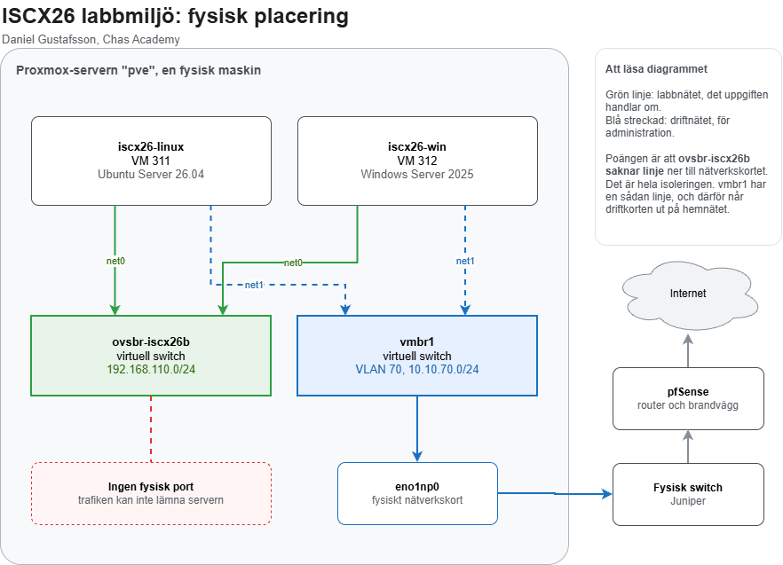

# Labbdokumentation: virtuell labbmiljö och nätverk

**Daniel Gustafsson**
Chas Academy, ISCX26
September 2026

> (mall) Rader som börjar med `> (mall)` är instruktioner till mig själv. De tas bort
> (mall) när avsnittet är klart. Ett avsnitt är inte klart så länge en sådan rad finns kvar.

---

## 1. Introduktion och plan

### 1.1 Vad uppgiften går ut på

Jag bygger en liten labbmiljö med två virtuella maskiner, en Linuxserver och en
Windowsserver, på ett gemensamt internt nät med fasta IP-adresser. På dem utför
jag grundläggande kommandoradsarbete med mappar, grupper och behörigheter.
Arbetet versioneras i Git, och jag granskar ett AI-svar kritiskt genom att
testa det i stället för att lita på det.

### 1.2 Vad som ska bevisas

| Del | Kursmål | Vad som måste finnas i dokumentet |
|---|---|---|
| 1 | 10 | Repo skapat med `git init`, minst fem commits som speglar arbetet |
| 2 | 8 | Två VM på gemensamt internt nät, statiska adresser, nätverkstabell |
| 3 | 9 | Linux: mapp, grupp, 750/640, `ls -la`, ping, `ip addr show` |
| 3 | 9 | Windows: mapp, `Get-Acl`, ping, `ipconfig /all` |
| 4 | 11 | Prompt och svar ordagrant, verifiering, egen kritisk granskning |

### 1.3 Miljö och avgränsning

Hypervisor är min Proxmox-server. Maskinerna skapas med Terraform, så att
miljön finns som kod i repot. Windows installeras från ISO för hand, eftersom
det inte finns någon färdig mall.

| | Linux | Windows |
|---|---|---|
| VM-id | 311 | 312 |
| Hostname | `iscx26-linux` | `iscx26-win` |
| OS | Ubuntu Server 26.04 | Windows Server 2025 |
| Labbnät | 192.168.110.50/24 | 192.168.110.51/24 |
| Driftnät | DHCP på VLAN 70 | DHCP på VLAN 70 |

Labbnätet är en ny OVS-brygga, `ovsbr-iscx26b`, utan fysisk port. Den skiljs
från bryggan i mitt tidigare labb, och subnätet `192.168.110.0/24` krockar inte
med något annat.

**Rörs inte:** övriga virtuella maskiner på servern, bryggorna `vmbr0` och
`vmbr1`, filen `/etc/network/interfaces`, och det tidigare labbet (VM 301 och
302).

**Lämnas utanför:** härdning av Windows-ACL:en. Uppgiften ber mig dokumentera
den, inte ändra den.

### 1.4 Risker jag känner till i förväg

Jag har byggt en liknande miljö förut och vet var det brukar gå fel. Varje risk
har en åtgärd som ska vara på plats innan jag når det steget.

| Risk | Åtgärd |
|---|---|
| cloud-init skriver aldrig någon nätverkskonfiguration om korten pekas ut med MAC-adress | Peka ut korten med namn, `ens18` och `ens19` |
| Terraform vill stänga av Windows för att `q35` blivit `pc-q35-11.0+pve2` | `machine` i `ignore_changes` från början |
| En ändrad kommentar i cloud-init-filen får Terraform att skapa om Linuxservern | `source_raw` i `ignore_changes` på snippets |
| Gästagenten i Windows kör men svarar inte | Installera hela `virtio-win-gt-x64.msi`, inte bara agenten |
| Windows klassar nätet som publikt och blockerar allt | Sätt nätverksprofilen till privat |
| Ping mot Windows får inget svar | Slå på brandväggsregeln `FPS-ICMP4-ERQ-In` |
| Tabellen visar ett hostname som inte stämmer | `Rename-Computer` och omstart innan tabellen fylls i |
| Minnet tar slut på servern | 20 GB ledigt, labbet behöver 10 GB. Kontrolleras innan `apply` |

Ingen `terraform apply` körs utan att planen först är läst rad för rad.

## 2. Miljö och nätverk

### 2.1 Nätverkstabell

| Hostname | Operativsystem | IP-adress | Subnätmask | Standard gateway |
|---|---|---|---|---|
| `iscx26-linux` | Ubuntu Server 26.04 LTS | 192.168.110.50 | 255.255.255.0 | ingen |
| `iscx26-win` | Windows Server 2025 | 192.168.110.51 | 255.255.255.0 | ingen |

Tabellen gäller labbnätet, som är det uppgiften handlar om. Varje värde är
hämtat ur en utskrift längre ner i avsnittet.

Kolumnen för gateway står tom med flit. En gateway är den router som trafiken
skickas till när målet ligger i ett annat nät. Labbnätet har ingen router och
ingen väg ut, så det finns ingenting att skicka vidare till.

### 2.2 Logiskt diagram


Varje maskin har två nätverkskort. Det heldragna är labbnätet, som bara når
den andra maskinen. Det streckade är driftnätet, som jag behöver för att
installera paket och administrera maskinerna. Servrar har ofta ett separat nät
för administration, skilt från det nät där de gör sitt jobb.

### 2.3 Fysisk placering



Båda maskinerna och båda switcharna finns i samma fysiska server. Det som
skiljer dem åt syns längst ner i bilden: `vmbr1` har en linje till serverns
nätverkskort och vidare ut, `ovsbr-iscx26b` har ingen.

Källfilen ligger i `diagram/labbmiljo-fysisk.drawio`, ritad i draw.io och
sparad okomprimerad. En okomprimerad fil är vanlig text, så när diagrammet
ändras visar Git vad som ändrades i stället för bara att filen bytts ut.

### 2.4 Hur miljön skapades

**Det isolerade labbnätet**

Labbnätet är en virtuell switch i Proxmox som saknar fysiskt nätverkskort.
Trafik som går in i den kan bara nå de maskiner som också sitter i den.

```bash
ovs-vsctl --may-exist add-br ovsbr-iscx26b
ip link set ovsbr-iscx26b up
```

Kontrollen efteråt:

```
finns enligt proxmox test: JA
fysiska portar: 0
ipv4 på bryggan: 0
/etc/network/interfaces orörd
```

Bryggan skapas med Open vSwitch och sparas i dess egen databas, inte i
Proxmox nätverksfil. Blir något fel i labbet kan det därför aldrig hindra
servern från att komma upp med sitt vanliga nätverk.

**Maskinerna, som kod**

Båda maskinerna beskrivs i Terraform i mappen `terraform/`. Linuxservern klonas
från en färdig Ubuntu-mall och får sina adresser via cloud-init. Windowsservern
skapas tom med installationsskivan i CD-enheten.

```bash
terraform validate
terraform plan -out=tfplan
terraform apply tfplan
```

Planen läste jag rad för rad innan den kördes:

```
Plan: 4 to add, 0 to change, 0 to destroy.
```

Fyra nya saker, alltså två maskiner och två cloud-init-filer, och ingenting
befintligt ändrat eller borttaget. På en server där tio andra maskiner kör är
det den raden som avgör om det är säkert att fortsätta.

**Drivrutinsskivan till Windows**

Windows behöver drivrutiner från skivan `virtio-win` för att Proxmox ska kunna
läsa av maskinen. Terraform tillåter bara en CD-enhet, så den andra hängdes på
med Proxmox eget verktyg:

```bash
qm set 312 --ide3 local:iso/virtio-win.iso,media=cdrom
```

**Windows efter installationen**

Korten pekas ut med MAC-adress, eftersom Windows döper dem till "Ethernet" och
"Ethernet 2" i den ordning det råkar hitta dem.

```powershell
$labb  = Get-NetAdapter | Where-Object MacAddress -eq 'BC-24-11-00-C3-12'
$drift = Get-NetAdapter | Where-Object MacAddress -eq 'BC-24-11-00-D3-12'
Rename-NetAdapter -Name $labb.Name  -NewName 'Labb'
Rename-NetAdapter -Name $drift.Name -NewName 'Drift'
New-NetIPAddress -InterfaceAlias 'Labb' -IPAddress 192.168.110.51 -PrefixLength 24
Get-NetConnectionProfile | Set-NetConnectionProfile -NetworkCategory Private
Enable-NetFirewallRule -Name FPS-ICMP4-ERQ-In
Rename-Computer -NewName 'iscx26-win' -Force
Restart-Computer
```

Två av raderna är lätta att glömma men avgörande. Windows klassar ett okänt
nät som publikt och blockerar då nästan all inkommande trafik, så profilen
sätts till privat. Och Windows svarar inte på ping förrän regeln
`FPS-ICMP4-ERQ-In` är påslagen. Utan dem ser det ut som att nätet är trasigt,
fast adresserna är rätt.

### 2.5 Verifiering

**Linuxservern, avläst inifrån maskinen**

```
$ hostnamectl --static
iscx26-linux

$ ip -4 -br addr show
lo               UNKNOWN        127.0.0.1/8
ens18            UP             192.168.110.50/24
ens19            UP             10.10.70.112/24 metric 100

$ ip route
default via 10.10.70.1 dev ens19 proto dhcp src 10.10.70.112 metric 100
192.168.110.0/24 dev ens18 proto kernel scope link src 192.168.110.50

$ cloud-init status --long
status: done
errors: []
```

Standardrutten går ut via driftkortet `ens19`. Labbnätet ligger direkt på
`ens18` utan någon gateway, precis som tabellen säger.

**Windowsservern, före och efter**

```
InterfaceAlias IPAddress      PrefixLength PrefixOrigin
-------------- ---------      ------------ ------------
Drift          10.10.70.113             24         Dhcp
Labb           192.168.110.51           24       Manual

InterfaceAlias NetworkCategory
-------------- ---------------
Drift                  Private
Labb                   Private
```

`Manual` betyder att adressen är satt för hand, alltså statisk. Före ändringen
stod båda näten som `Public`.

**Ping åt båda hållen**

Från Linux till Windows:

```
$ ping -c4 192.168.110.51
64 bytes from 192.168.110.51: icmp_seq=1 ttl=128 time=2.98 ms
64 bytes from 192.168.110.51: icmp_seq=2 ttl=128 time=1.05 ms
64 bytes from 192.168.110.51: icmp_seq=3 ttl=128 time=1.21 ms
64 bytes from 192.168.110.51: icmp_seq=4 ttl=128 time=1.30 ms

4 packets transmitted, 4 received, 0% packet loss, time 3004ms
```

Från Windows till Linux:

```
> ping -n 4 192.168.110.50
Reply from 192.168.110.50: bytes=32 time<1ms TTL=64
Reply from 192.168.110.50: bytes=32 time=1ms TTL=64
Reply from 192.168.110.50: bytes=32 time=2ms TTL=64
Reply from 192.168.110.50: bytes=32 time<1ms TTL=64

Packets: Sent = 4, Received = 4, Lost = 0 (0% loss)

> hostname
iscx26-win
```

TTL-värdet visar vilket system som svarar. Linux börjar på 64 och Windows på
128, och värdet minskar med ett för varje router paketet passerar. Att båda är
orörda visar att svaren kommer från rätt maskiner och att ingen router ligger
emellan.

### 2.6 Det som gick fel, och hur jag hittade det

Jag hade skrivit ner de risker jag kände till innan arbetet började (avsnitt
1.4). Linuxservern fick rätt adress på första försöket, vilket var just den del
som krånglade mest förra gången. Tre saker blev ändå inte som planerat.

**Terraform tillåter bara en CD-enhet.** Planen var att montera både
installationsskivan och drivrutinsskivan direkt i koden. `terraform validate`
stoppade det innan något byggdes:

```
Error: Too many cdrom blocks
No more than 1 "cdrom" blocks are allowed
```

Jag löste det genom att låta Terraform skapa Windowsmaskinen avstängd och sedan
hänga på den andra skivan med `qm set`. Felet hittades vid skrivbordet och inte
på servern, vilket är poängen med att validera innan man kör.

**Maskinen startades innan skivan var på plats.** Windowsmaskinen skapades
avstängd som planerat, men startades för hand i webbgränssnittet innan den
andra skivan hunnit monteras. Skivan hamnade då som en väntande ändring:

```
cur ide2: local:iso/winserver2025-eval.iso
new ide3: local:iso/virtio-win.iso
```

En omstart inifrån Windows räcker inte för att den ska slå igenom. Maskinen
måste stängas av och startas från Proxmox. Efter det syntes skivan.

**Gästagenten svarade inte.** Agenten installerades och syntes som körande i
Windows, men Proxmox svarade:

```
QEMU guest agent is not running
```

Orsaken var att bara agentens eget paket hade installerats, inte
drivrutinspaketet. Agenten pratar med Proxmox genom en virtuell serieport, och
drivrutinen för den finns bara i `virtio-win-gt-x64.msi`. Utan den körde
agenten men hade ingen kanal att prata genom.

Det här stod som risk i planen, med rätt åtgärd. Den inträffade ändå, eftersom
planen inte var framme när installationen gjordes. Lärdomen är att en
risktabell måste läsas vid det steg den gäller, inte bara skrivas i början.

## 3. Genomförande

> (mall) Ett underavsnitt per moment i uppgiften. Samma form varje gång:
> (mall) kommando, ordagrann utskrift, en mening om vad utskriften bevisar.
> (mall) Räcker inte listningen som bevis, testa skarpt (till exempel som en
> (mall) användare utan rättighet) och visa nekandet.

### 3.1

### 3.2

---

## 4. Git och versionshantering

### 4.1 Struktur

```
<reponamn>/
├── Labbdokumentation.md
├── README.md
├── bilder/
└── diagram/
```

### 4.2 Vad som inte ligger i repot

> (mall) Vad `.gitignore` stoppar och varför. Bevis med `git check-ignore -v`.

### 4.3 Repository

> (mall) Länk. Privat eller publikt, och när det byts.

### 4.4 Commit-historik

> (mall) Regenereras ALLRA SIST, med noten att den är en commit kortare än repot.

```
$ git log --pretty=format:'%h  %ad  %s' --date=format:'%Y-%m-%d %H:%M'
```

---

## 5. AI-stöd och granskning

> (mall) Bara om uppgiften kräver det. Prompt ordagrant, svar ordagrant, verifiering
> (mall) på en kopia, mätningar, och sist min egen bedömning i egen text.

### 5.1 Verktyg och prompt

### 5.2 Svaret, ordagrant

### 5.3 Så verifierade jag

### 5.4 Vad mätningarna visade

### 5.5 Min bedömning

---

## 6. Reflektion

### 6.1 Vad jag inte testade

> (mall) Ärligt. Det som lämnades oprövat och varför.

### 6.2 Vad jag tar med mig

> (mall) Tre punkter räcker. Konkreta, inte "jag lärde mig mycket".
