# Labbdokumentation: virtuell labbmiljö och nätverk

**Daniel Gustafsson**
Chas Academy, ISCX26
September 2026

> (mall) Rader som börjar med `> (mall)` är instruktioner till mig själv. De tas bort
> (mall) när avsnittet är klart. Ett avsnitt är inte klart så länge en sådan rad finns kvar.

---

## 1. Introduktion och plan

### 1.1 Vad uppgiften går ut på

Jag bygger en liten labbmiljö med två virtuella maskiner, en Linuxserver och en
Windowsserver, på ett gemensamt internt nät med fasta IP-adresser. På dem utför
jag grundläggande kommandoradsarbete med mappar, grupper och behörigheter.
Arbetet versioneras i Git, och jag granskar ett AI-svar kritiskt genom att
testa det i stället för att lita på det.

### 1.2 Vad som ska bevisas

| Del | Kursmål | Vad som måste finnas i dokumentet |
|---|---|---|
| 1 | 10 | Repo skapat med `git init`, minst fem commits som speglar arbetet |
| 2 | 8 | Två VM på gemensamt internt nät, statiska adresser, nätverkstabell |
| 3 | 9 | Linux: mapp, grupp, 750/640, `ls -la`, ping, `ip addr show` |
| 3 | 9 | Windows: mapp, `Get-Acl`, ping, `ipconfig /all` |
| 4 | 11 | Prompt och svar ordagrant, verifiering, egen kritisk granskning |

### 1.3 Miljö och avgränsning

Hypervisor är min Proxmox-server. Maskinerna skapas med Terraform, så att
miljön finns som kod i repot. Windows installeras från ISO för hand, eftersom
det inte finns någon färdig mall.

| | Linux | Windows |
|---|---|---|
| VM-id | 311 | 312 |
| Hostname | `iscx26-linux` | `iscx26-win` |
| OS | Ubuntu Server 26.04 | Windows Server 2025 |
| Labbnät | 192.168.110.50/24 | 192.168.110.51/24 |
| Driftnät | DHCP på VLAN 70 | DHCP på VLAN 70 |

Labbnätet är en ny OVS-brygga, `ovsbr-iscx26b`, utan fysisk port. Den skiljs
från bryggan i mitt tidigare labb, och subnätet `192.168.110.0/24` krockar inte
med något annat.

**Rörs inte:** övriga virtuella maskiner på servern, bryggorna `vmbr0` och
`vmbr1`, filen `/etc/network/interfaces`, och det tidigare labbet (VM 301 och
302).

**Lämnas utanför:** härdning av Windows-ACL:en. Uppgiften ber mig dokumentera
den, inte ändra den.

### 1.4 Risker jag känner till i förväg

Jag har byggt en liknande miljö förut och vet var det brukar gå fel. Varje risk
har en åtgärd som ska vara på plats innan jag når det steget.

| Risk | Åtgärd |
|---|---|
| cloud-init skriver aldrig någon nätverkskonfiguration om korten pekas ut med MAC-adress | Peka ut korten med namn, `ens18` och `ens19` |
| Terraform vill stänga av Windows för att `q35` blivit `pc-q35-11.0+pve2` | `machine` i `ignore_changes` från början |
| En ändrad kommentar i cloud-init-filen får Terraform att skapa om Linuxservern | `source_raw` i `ignore_changes` på snippets |
| Gästagenten i Windows kör men svarar inte | Installera hela `virtio-win-gt-x64.msi`, inte bara agenten |
| Windows klassar nätet som publikt och blockerar allt | Sätt nätverksprofilen till privat |
| Ping mot Windows får inget svar | Slå på brandväggsregeln `FPS-ICMP4-ERQ-In` |
| Tabellen visar ett hostname som inte stämmer | `Rename-Computer` och omstart innan tabellen fylls i |
| Minnet tar slut på servern | 20 GB ledigt, labbet behöver 10 GB. Kontrolleras innan `apply` |

Ingen `terraform apply` körs utan att planen först är läst rad för rad.

## 2. Miljö och nätverk

### 2.1 Nätverkstabell

| Hostname | Operativsystem | IP-adress | Subnätmask | Standard gateway |
|---|---|---|---|---|
| `iscx26-linux` | Ubuntu Server 26.04 LTS | 192.168.110.50 | 255.255.255.0 | ingen |
| `iscx26-win` | Windows Server 2025 | 192.168.110.51 | 255.255.255.0 | ingen |

Tabellen gäller labbnätet, som är det uppgiften handlar om. Varje värde är
hämtat ur en utskrift längre ner i avsnittet.

Kolumnen för gateway står tom med flit. En gateway är den router som trafiken
skickas till när målet ligger i ett annat nät. Labbnätet har ingen router och
ingen väg ut, så det finns ingenting att skicka vidare till.

### 2.2 Logiskt diagram

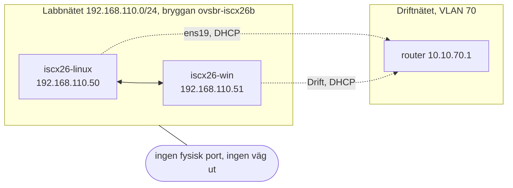

Varje maskin har två nätverkskort. Det heldragna är labbnätet, som bara når
den andra maskinen. Det streckade är driftnätet, som jag behöver för att
installera paket och administrera maskinerna. Servrar har ofta ett separat nät
för administration, skilt från det nät där de gör sitt jobb.

### 2.3 Fysisk placering


Båda maskinerna och båda switcharna finns i samma fysiska server. Det som
skiljer dem åt syns längst ner i bilden: `vmbr1` har en linje till serverns
nätverkskort och vidare ut, `ovsbr-iscx26b` har ingen.

Källfilen ligger i `diagram/labbmiljo-fysisk.drawio`, ritad i draw.io och
sparad okomprimerad. En okomprimerad fil är vanlig text, så när diagrammet
ändras visar Git vad som ändrades i stället för bara att filen bytts ut.

### 2.4 Hur miljön skapades

**Det isolerade labbnätet**

Labbnätet är en virtuell switch i Proxmox som saknar fysiskt nätverkskort.
Trafik som går in i den kan bara nå de maskiner som också sitter i den.

```bash
ovs-vsctl --may-exist add-br ovsbr-iscx26b
ip link set ovsbr-iscx26b up
```

Kontrollen efteråt:

```
finns enligt proxmox test: JA
fysiska portar: 0
ipv4 på bryggan: 0
/etc/network/interfaces orörd
```

Bryggan skapas med Open vSwitch och sparas i dess egen databas, inte i
Proxmox nätverksfil. Blir något fel i labbet kan det därför aldrig hindra
servern från att komma upp med sitt vanliga nätverk.

**Maskinerna, som kod**

Båda maskinerna beskrivs i Terraform i mappen `terraform/`. Linuxservern klonas
från en färdig Ubuntu-mall och får sina adresser via cloud-init. Windowsservern
skapas tom med installationsskivan i CD-enheten.

```bash
terraform validate
terraform plan -out=tfplan
terraform apply tfplan
```

Planen läste jag rad för rad innan den kördes:

```
Plan: 4 to add, 0 to change, 0 to destroy.
```

Fyra nya saker, alltså två maskiner och två cloud-init-filer, och ingenting
befintligt ändrat eller borttaget. På en server där tio andra maskiner kör är
det den raden som avgör om det är säkert att fortsätta.

**Drivrutinsskivan till Windows**

Windows behöver drivrutiner från skivan `virtio-win` för att Proxmox ska kunna
läsa av maskinen. Terraform tillåter bara en CD-enhet, så den andra hängdes på
med Proxmox eget verktyg:

```bash
qm set 312 --ide3 local:iso/virtio-win.iso,media=cdrom
```

**Windows efter installationen**

Korten pekas ut med MAC-adress, eftersom Windows döper dem till "Ethernet" och
"Ethernet 2" i den ordning det råkar hitta dem.

```powershell
$labb  = Get-NetAdapter | Where-Object MacAddress -eq 'BC-24-11-00-C3-12'
$drift = Get-NetAdapter | Where-Object MacAddress -eq 'BC-24-11-00-D3-12'
Rename-NetAdapter -Name $labb.Name  -NewName 'Labb'
Rename-NetAdapter -Name $drift.Name -NewName 'Drift'
New-NetIPAddress -InterfaceAlias 'Labb' -IPAddress 192.168.110.51 -PrefixLength 24
Get-NetConnectionProfile | Set-NetConnectionProfile -NetworkCategory Private
Enable-NetFirewallRule -Name FPS-ICMP4-ERQ-In
Rename-Computer -NewName 'iscx26-win' -Force
Restart-Computer
```

Två av raderna är lätta att glömma men avgörande. Windows klassar ett okänt
nät som publikt och blockerar då nästan all inkommande trafik, så profilen
sätts till privat. Och Windows svarar inte på ping förrän regeln
`FPS-ICMP4-ERQ-In` är påslagen. Utan dem ser det ut som att nätet är trasigt,
fast adresserna är rätt.

**Fjärråtkomst med SSH**

Jag vill arbeta i båda maskinerna från samma terminal i VS Code. Linuxservern
har SSH från början, med min nyckel inlagd av cloud-init. OpenSSH-servern
följer med Windows Server 2025, men den är avstängd, så den slogs på:

```powershell
Set-Service sshd -StartupType Automatic
Start-Service sshd
Set-Content C:\ProgramData\ssh\administrators_authorized_keys '<min publika nyckel>' -Encoding ascii
icacls C:\ProgramData\ssh\administrators_authorized_keys /inheritance:r /grant '*S-1-5-32-544:F' /grant '*S-1-5-18:F'
New-ItemProperty HKLM:\SOFTWARE\OpenSSH -Name DefaultShell -PropertyType String -Force `
    -Value 'C:\Windows\System32\WindowsPowerShell\v1.0\powershell.exe'
Set-NetFirewallRule -Name OpenSSH-Server-In-TCP -InterfaceAlias Drift
```

I `C:\ProgramData\ssh\sshd_config` lade jag till två rader, före blocket
`Match Group administrators`. Står de efter gäller de bara inuti blocket.
Filen kontrollerades med `sshd -t` innan tjänsten startades om.

```
PasswordAuthentication no
KbdInteractiveAuthentication no
```

Det här gör raderna:

- Konton som är administratörer läser sin nyckel från en gemensam fil, inte
  från sin egen profil. Filen får bara vara läsbar för Administrators och
  SYSTEM, annars vägrar SSH-servern använda den. Det är det `icacls` ser till.
- Skalet blir PowerShell i stället för cmd.
- Brandväggen släpper bara in SSH via driftkortet. Från labbnätet går det inte
  att nå port 22.
- Inloggning med lösenord är avstängd. Bara den som har nyckeln kommer in.

Kontrollen, från min egen dator:

```
> ssh -o BatchMode=yes iscx26-win whoami
iscx26-win\administrator

> ssh -o BatchMode=yes -o PubkeyAuthentication=no iscx26-win exit
Administrator@10.10.70.113: Permission denied (publickey).

> ssh -o BatchMode=yes -o PubkeyAuthentication=no iscx26-linux exit
daniel@10.10.70.112: Permission denied (publickey).
```

`BatchMode=yes` gör att `ssh` aldrig frågar efter något utan ger upp direkt,
och `PubkeyAuthentication=no` låtsas att jag saknar nyckel. `(publickey)` är
då det enda sättet som erbjuds, på båda maskinerna. Första
gången jag anslöt sparades maskinernas fingeravtryck. Jag jämförde dem med
fingeravtrycken avlästa inifrån maskinerna, och de stämde. Då vet jag att det
är rätt maskin som svarar.

**Tidszonen i Windows**

När mappen i avsnitt 3.2 skapades första gången fick den tiden 02:36, fast
klockan var 11:36. Windows hade kvar tidszonen från installationen:

```
> Get-TimeZone

Id                         : Pacific Standard Time
DisplayName                : (UTC-08:00) Pacific Time (US & Canada)
StandardName               : Pacific Standard Time
DaylightName               : Pacific Daylight Time
BaseUtcOffset              : -08:00:00
SupportsDaylightSavingTime : True

> Set-TimeZone -Id "W. Europe Standard Time"
> Get-Date

den 24 september 2026 11:41:06
```

Jag tog bort mappen, rättade tidszonen och skapade mappen igen, så att
tiderna i Linux och Windows går att jämföra. Datumet skrivs på svenska
eftersom språkinställningen i Windows är svensk, trots engelska menyer.

### 2.5 Verifiering

**Linuxservern, avläst inifrån maskinen**

```
$ hostnamectl --static
iscx26-linux

$ ip -4 -br addr show
lo               UNKNOWN        127.0.0.1/8
ens18            UP             192.168.110.50/24
ens19            UP             10.10.70.112/24 metric 100

$ ip route
default via 10.10.70.1 dev ens19 proto dhcp src 10.10.70.112 metric 100
192.168.110.0/24 dev ens18 proto kernel scope link src 192.168.110.50

$ cloud-init status --long
status: done
errors: []
```

Standardrutten går ut via driftkortet `ens19`. Labbnätet ligger direkt på
`ens18` utan någon gateway, precis som tabellen säger.

**Windowsservern, före och efter**

```
InterfaceAlias IPAddress      PrefixLength PrefixOrigin
-------------- ---------      ------------ ------------
Drift          10.10.70.113             24         Dhcp
Labb           192.168.110.51           24       Manual

InterfaceAlias NetworkCategory
-------------- ---------------
Drift                  Private
Labb                   Private
```

`Manual` betyder att adressen är satt för hand, alltså statisk. Före ändringen
stod båda näten som `Public`.

**Ping åt båda hållen**

Från Linux till Windows:

```
$ ping -c4 192.168.110.51
64 bytes from 192.168.110.51: icmp_seq=1 ttl=128 time=2.98 ms
64 bytes from 192.168.110.51: icmp_seq=2 ttl=128 time=1.05 ms
64 bytes from 192.168.110.51: icmp_seq=3 ttl=128 time=1.21 ms
64 bytes from 192.168.110.51: icmp_seq=4 ttl=128 time=1.30 ms

4 packets transmitted, 4 received, 0% packet loss, time 3004ms
```

Från Windows till Linux:

```
> ping -n 4 192.168.110.50
Reply from 192.168.110.50: bytes=32 time<1ms TTL=64
Reply from 192.168.110.50: bytes=32 time=1ms TTL=64
Reply from 192.168.110.50: bytes=32 time=2ms TTL=64
Reply from 192.168.110.50: bytes=32 time<1ms TTL=64

Packets: Sent = 4, Received = 4, Lost = 0 (0% loss)

> hostname
iscx26-win
```

TTL-värdet visar vilket system som svarar. Linux börjar på 64 och Windows på
128, och värdet minskar med ett för varje router paketet passerar. Att båda är
orörda visar att svaren kommer från rätt maskiner och att ingen router ligger
emellan.

### 2.6 Det som gick fel, och hur jag hittade det

Jag hade skrivit ner de risker jag kände till innan arbetet började (avsnitt
1.4). Linuxservern fick rätt adress på första försöket, vilket var just den del
som krånglade mest förra gången. Tre saker blev ändå inte som planerat.

**Terraform tillåter bara en CD-enhet.** Planen var att montera både
installationsskivan och drivrutinsskivan direkt i koden. `terraform validate`
stoppade det innan något byggdes:

```
Error: Too many cdrom blocks
No more than 1 "cdrom" blocks are allowed
```

Jag löste det genom att låta Terraform skapa Windowsmaskinen avstängd och sedan
hänga på den andra skivan med `qm set`. Felet hittades vid skrivbordet och inte
på servern, vilket är poängen med att validera innan man kör.

**Maskinen startades innan skivan var på plats.** Windowsmaskinen skapades
avstängd som planerat, men startades för hand i webbgränssnittet innan den
andra skivan hunnit monteras. Skivan hamnade då som en väntande ändring:

```
cur ide2: local:iso/winserver2025-eval.iso
new ide3: local:iso/virtio-win.iso
```

En omstart inifrån Windows räcker inte för att den ska slå igenom. Maskinen
måste stängas av och startas från Proxmox. Efter det syntes skivan.

**Gästagenten svarade inte.** Agenten installerades och syntes som körande i
Windows, men Proxmox svarade:

```
QEMU guest agent is not running
```

Orsaken var att bara agentens eget paket hade installerats, inte
drivrutinspaketet. Agenten pratar med Proxmox genom en virtuell serieport, och
drivrutinen för den finns bara i `virtio-win-gt-x64.msi`. Utan den körde
agenten men hade ingen kanal att prata genom.

Det här stod som risk i planen, med rätt åtgärd. Den inträffade ändå, eftersom
planen inte var framme när installationen gjordes. Lärdomen är att en
risktabell måste läsas vid det steg den gäller, inte bara skrivas i början.

## 3. Genomförande

Alla kommandon i det här avsnittet skrev jag själv i en terminal i VS Code,
inloggad med SSH på respektive maskin. Varje steg har kommandot, utskriften
ordagrant och en skärmdump av samma terminal.

### 3.1 Linux

Jag är inloggad som den vanliga användaren `daniel`. Kontot är inte root, men
får köra kommandon som root med `sudo`. Det spelar roll längre ner.

**Mappen och filen**

```
$ sudo mkdir -p /var/systementor/konsultdata
$ sudo touch /var/systementor/konsultdata/anteckningar.txt
$ ls -la /var/systementor/konsultdata
total 8
drwxr-xr-x 2 root root 4096 Sep 24 08:39 .
drwxr-xr-x 3 root root 4096 Sep 24 08:39 ..
-rw-r--r-- 1 root root    0 Sep 24 08:39 anteckningar.txt
```

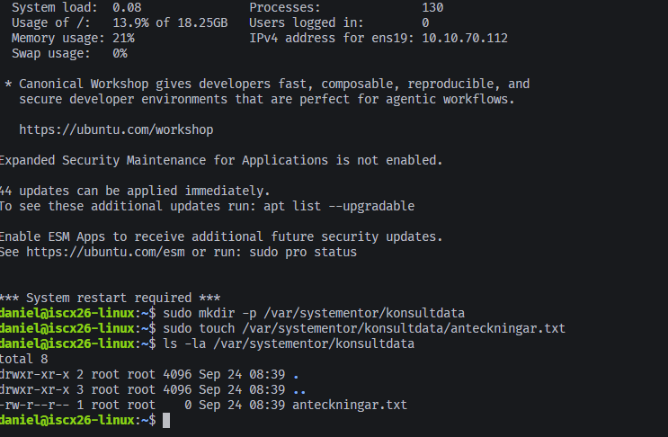

`-p` behövs eftersom `/var/systementor` inte fanns, så båda nivåerna skapas på
en gång. `sudo` behövs eftersom `/var` ägs av root. Mappen fick 755 och filen
644 utan att jag bad om det. Det styrs av inställningen `umask`, som på den
här maskinen är 0022. Just nu kan alla användare på maskinen läsa filen.

**Gruppen konsulter**

```
$ sudo groupadd konsulter
$ getent group konsulter
konsulter:x:1001:
$ sudo chgrp konsulter /var/systementor/konsultdata
$ sudo chgrp konsulter /var/systementor/konsultdata/anteckningar.txt
$ ls -la /var/systementor/konsultdata
total 8
drwxr-xr-x 2 root konsulter 4096 Sep 24 08:39 .
drwxr-xr-x 3 root root      4096 Sep 24 08:39 ..
-rw-r--r-- 1 root konsulter    0 Sep 24 08:39 anteckningar.txt
```

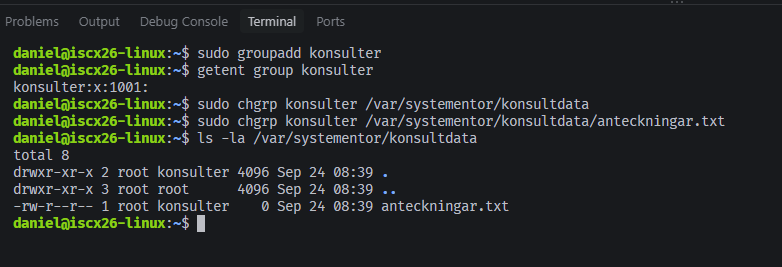

Gruppen fick id 1001. Efter sista kolonet står ingenting. Där listas gruppens
medlemmar, så gruppen är tom. `chgrp` byter bara gruppägare: ägaren är
fortfarande root och rättigheterna är desamma som förut.

**Rättigheterna 750 och 640**

Varje siffra är summan av läsa (4), skriva (2) och köra (1). För en mapp
betyder "köra" att man får gå in i den. Siffrorna gäller i tur och ordning
ägaren, gruppen och övriga.

| | Ägare (root) | Grupp (konsulter) | Övriga |
|---|---|---|---|
| Mappen, 750 | 7: läsa, skriva, gå in | 5: läsa, gå in | 0: ingenting |
| Filen, 640 | 6: läsa, skriva | 4: läsa | 0: ingenting |

```
$ sudo chmod 750 /var/systementor/konsultdata
$ sudo chmod 640 /var/systementor/konsultdata/anteckningar.txt
$ ls -la /var/systementor/konsultdata
ls: cannot open directory '/var/systementor/konsultdata': Permission denied
$ namei -l /var/systementor/konsultdata/anteckningar.txt
f: /var/systementor/konsultdata/anteckningar.txt
drwxr-xr-x root root      /
drwxr-xr-x root root      var
drwxr-xr-x root root      systementor
drwxr-x--- root konsulter konsultdata
                           anteckningar.txt - Permission denied
```

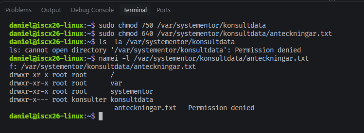

Här missade jag `sudo` på de två sista raderna. Det blev ändå ett bevis. Jag är
varken root eller med i `konsulter`, så jag räknas som övriga, och övriga har
0 på mappen. `namei -l` visar rättigheterna för varje mapp på vägen ner till
filen och visar precis var det tar stopp: `/`, `var` och `systementor` går
att passera, `konsultdata` gör det inte.

Samma kommandon med `sudo`:

```
$ sudo ls -la /var/systementor/konsultdata
total 8
drwxr-x--- 2 root konsulter 4096 Sep 24 08:39 .
drwxr-xr-x 3 root root      4096 Sep 24 08:39 ..
-rw-r----- 1 root konsulter    0 Sep 24 08:39 anteckningar.txt
$ sudo namei -l /var/systementor/konsultdata/anteckningar.txt
f: /var/systementor/konsultdata/anteckningar.txt
drwxr-xr-x root root      /
drwxr-xr-x root root      var
drwxr-xr-x root root      systementor
drwxr-x--- root konsulter konsultdata
-rw-r----- root konsulter anteckningar.txt
```

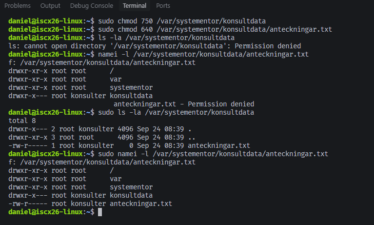

`drwxr-x---` är 750 och `-rw-r-----` är 640, precis som uppgiften kräver.

Det här är principen om lägsta behörighet, *least privilege*: varje
användare får precis det den behöver för sitt arbete och inget mer. Root
förvaltar filen. Konsulterna behöver läsa anteckningarna men inte ändra dem.
Alla andra behöver ingenting, och får därför ingenting. Blir ett konto
kapat kommer angriparen bara åt det kontot redan hade rätt till.

**Skarpt test**

Listan visar vad som borde gälla. För att se att det faktiskt gäller skrev jag
en rad i filen, skapade en testanvändare som är med i gruppen och provade tre
saker.

```
$ echo "Första anteckningen" | sudo tee /var/systementor/konsultdata/anteckningar.txt
Första anteckningen
$ sudo useradd -M -s /usr/sbin/nologin -G konsulter konsult1
$ sudo useradd -M -s /usr/sbin/nologin -G konsulter konsult1
id konsult1
useradd: user 'konsult1' already exists
uid=1001(konsult1) gid=1002(konsult1) groups=1002(konsult1),1001(konsulter)
$ sudo -u konsult1 cat /var/systementor/konsultdata/anteckningar.txt
Första anteckningen
$ sudo -u konsult1 bash -c 'echo test >> /var/systementor/konsultdata/anteckningar.txt'
bash: line 1: /var/systementor/konsultdata/anteckningar.txt: Permission denied
$ sudo -u nobody cat /var/systementor/konsultdata/anteckningar.txt
cat: /var/systementor/konsultdata/anteckningar.txt: Permission denied
```

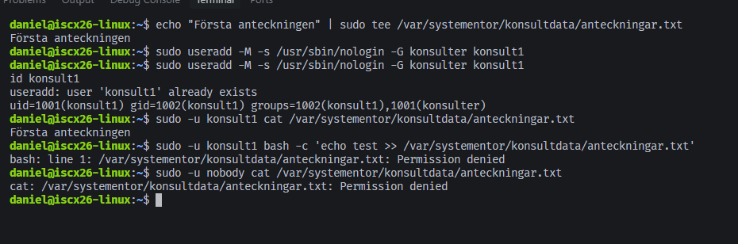

`useradd -M -s /usr/sbin/nologin` skapar en användare utan hemmapp som inte
kan logga in. Den finns bara för testet. `useradd` står två gånger eftersom
jag råkade klistra in raden en gång till. Andra gången svarade den att
användaren redan fanns, och ingenting ändrades.

Skrivtestet körs med `bash -c`. Utan det skulle mitt eget skal, som `daniel`,
öppna filen för `>>` innan `sudo` ens startat, och då testas fel användare.

| Test | Användare | Resultat | Varför |
|---|---|---|---|
| Läsa | konsult1 | fungerar | gruppen har 4, läsa |
| Skriva | konsult1 | `Permission denied` | gruppen saknar 2, skriva |
| Läsa | nobody | `Permission denied` | inte med i gruppen, övriga har 0 |

**Nätverket**

```
$ ping -c 4 192.168.110.51
PING 192.168.110.51 (192.168.110.51) 56(84) bytes of data.
64 bytes from 192.168.110.51: icmp_seq=1 ttl=128 time=3.24 ms
64 bytes from 192.168.110.51: icmp_seq=2 ttl=128 time=1.33 ms
64 bytes from 192.168.110.51: icmp_seq=3 ttl=128 time=1.26 ms
64 bytes from 192.168.110.51: icmp_seq=4 ttl=128 time=1.25 ms

--- 192.168.110.51 ping statistics ---
4 packets transmitted, 4 received, 0% packet loss, time 3004ms
rtt min/avg/max/mdev = 1.249/1.769/3.238/0.848 ms
$ ip addr show
1: lo: <LOOPBACK,UP,LOWER_UP> mtu 65536 qdisc noqueue state UNKNOWN group default qlen 1000
    link/loopback 00:00:00:00:00:00 brd 00:00:00:00:00:00
    inet 127.0.0.1/8 scope host lo
       valid_lft forever preferred_lft forever
    inet6 ::1/128 scope host noprefixroute
       valid_lft forever preferred_lft forever
2: ens18: <BROADCAST,MULTICAST,UP,LOWER_UP> mtu 1500 qdisc pfifo_fast state UP group default qlen 1000
    link/ether bc:24:11:00:c3:11 brd ff:ff:ff:ff:ff:ff
    altname enp6s18
    altname enxbc241100c311
    inet 192.168.110.50/24 brd 192.168.110.255 scope global ens18
       valid_lft forever preferred_lft forever
    inet6 fe80::be24:11ff:fe00:c311/64 scope link proto kernel_ll
       valid_lft forever preferred_lft forever
3: ens19: <BROADCAST,MULTICAST,UP,LOWER_UP> mtu 1500 qdisc pfifo_fast state UP group default qlen 1000
    link/ether bc:24:11:00:d3:11 brd ff:ff:ff:ff:ff:ff
    altname enp6s19
    altname enxbc241100d311
    inet 10.10.70.112/24 metric 100 brd 10.10.70.255 scope global dynamic ens19
       valid_lft 5614sec preferred_lft 5614sec
    inet6 fe80::be24:11ff:fe00:d311/64 scope link proto kernel_ll
       valid_lft forever preferred_lft forever
```

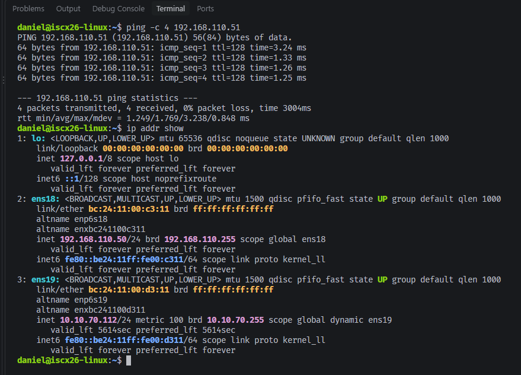

Alla fyra paketen kom fram, och `ttl=128` visar att det är Windows som svarar.
I `ip addr show` finns labbnätets adress `192.168.110.50/24` på `ens18`, med
MAC-adressen `bc:24:11:00:c3:11` som jag satte i Terraform. Två ord skiljer de
två korten åt. `ens18` har `valid_lft forever`, adressen är statisk och gäller
tills någon ändrar den. `ens19` har `dynamic` och `valid_lft 5614sec`, adressen
är lånad från DHCP-servern och måste förnyas.

### 3.2 Windows

Här är jag inloggad som `Administrator` med SSH, och skalet är PowerShell.

**Mappen och dess rättigheter**

```
> New-Item -ItemType Directory -Path C:\Systementor\KonsultData

    Directory: C:\Systementor

Mode                 LastWriteTime         Length Name
----                 -------------         ------ ----
d-----        2026-09-24     11:41                KonsultData

> Get-Acl C:\Systementor\KonsultData

    Directory: C:\Systementor

Path        Owner                  Access
----        -----                  ------
KonsultData BUILTIN\Administrators BUILTIN\Administrators Allow  FullControl...

> (Get-Acl C:\Systementor\KonsultData).Access | Format-Table IdentityReference,FileSystemRights,AccessControlType,IsInherited -AutoSize

IdentityReference                 FileSystemRights AccessControlType IsInherited
-----------------                 ---------------- ----------------- -----------
BUILTIN\Administrators                 FullControl             Allow       False
NT AUTHORITY\SYSTEM                    FullControl             Allow        True
BUILTIN\Administrators                 FullControl             Allow        True
BUILTIN\Users          ReadAndExecute, Synchronize             Allow        True
BUILTIN\Users                           AppendData             Allow        True
BUILTIN\Users                          CreateFiles             Allow        True
CREATOR OWNER                            268435456             Allow        True
```

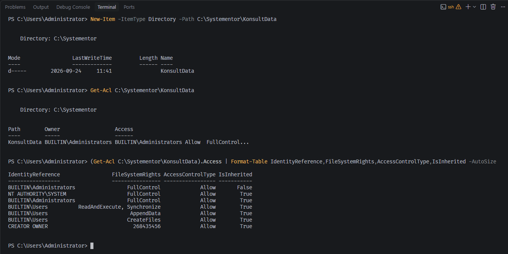

`New-Item` skapar båda nivåerna på en gång, som `mkdir -p` i Linux. `Get-Acl`
visar ägaren och en förkortad lista, så jag skrev ut listan i sin helhet på
sista raden. `IsInherited` talar om ifall rättigheten är ärvd från `C:\` eller
satt direkt på mappen.

För att förstå varför en rad inte var ärvd läste jag också ut rättigheterna
med `icacls`, som visar hur de förs vidare:

```
> icacls C:\
C:\ S-1-15-3-65536-1888954469-739942743-1668119174-2468466756-4239452838-1296943325-355587736-700089176:(S,RD,X,RA)
    NT AUTHORITY\SYSTEM:(OI)(CI)(F)
    BUILTIN\Administrators:(OI)(CI)(F)
    BUILTIN\Users:(OI)(CI)(RX)
    BUILTIN\Users:(CI)(AD)
    BUILTIN\Users:(CI)(IO)(WD)
    CREATOR OWNER:(OI)(CI)(IO)(F)

Successfully processed 1 files; Failed processing 0 files

> icacls C:\Systementor\KonsultData
C:\Systementor\KonsultData BUILTIN\Administrators:(F)
                           NT AUTHORITY\SYSTEM:(I)(OI)(CI)(F)
                           BUILTIN\Administrators:(I)(OI)(CI)(F)
                           BUILTIN\Users:(I)(OI)(CI)(RX)
                           BUILTIN\Users:(I)(CI)(AD)
                           BUILTIN\Users:(I)(CI)(WD)
                           CREATOR OWNER:(I)(OI)(CI)(IO)(F)

Successfully processed 1 files; Failed processing 0 files
```

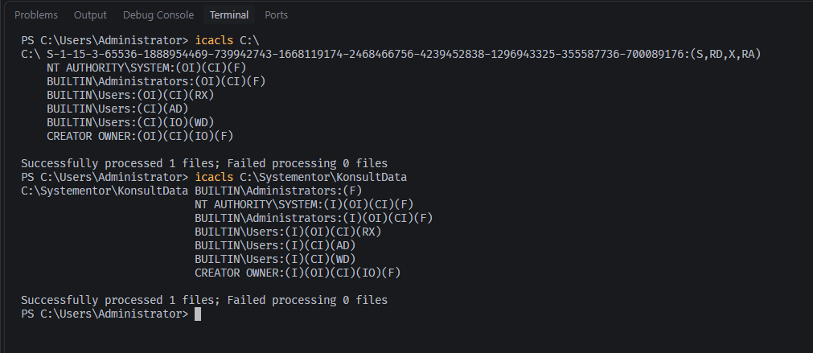

`(I)` betyder ärvd. `(OI)` och `(CI)` betyder att rättigheten förs vidare till
filer respektive undermappar. `(IO)` betyder att den bara förs vidare och inte
gäller själva mappen.

- **Raden med `False`.** `CREATOR OWNER:(F)` på `C:\` betyder att den som
  skapar en mapp får full kontroll över den. När mappen skapas byts
  "CREATOR OWNER" ut mot den verkliga ägaren, som här är
  `BUILTIN\Administrators`. Den nya raden sätts direkt på mappen och räknas
  därför inte som ärvd.
- **Siffran `268435456`.** Det är `0x10000000`, som betyder GENERIC_ALL,
  alltså allt. PowerShell har inget namn för den formen av rättighet och
  skriver siffran i stället.
- **Raden med ett långt SID på `C:\`** saknar `(OI)(CI)`. Den gäller bara
  `C:\` och kommer inte med i den nya mappen.

Det viktigaste står på raderna för `BUILTIN\Users`, alltså alla vanliga
användare på servern. `RX` låter dem läsa. `AD` och `WD`, i PowerShell
`AppendData` och `CreateFiles`, låter dem skapa undermappar och filer i
`KonsultData`. Linuxmappen i 3.1 stänger ute alla som inte är med i
`konsulter`. Den här mappen är med standardrättigheterna öppen för alla som
kan logga in på servern. Det bryter mot principen om lägsta behörighet från
3.1. För känslig konsultdata skulle arvet behöva brytas
och `BUILTIN\Users` bytas mot en grupp för konsulterna. Uppgiften bad bara om
att visa rättigheterna, så det har jag inte gjort.

**Nätverket**

```
> Test-Connection 192.168.110.50 -Count 4

Source        Destination     IPV4Address      IPV6Address                              Bytes    Time(ms)
------        -----------     -----------      -----------                              -----    --------
ISCX26-WIN    192.168.110.50                                                            32       10
ISCX26-WIN    192.168.110.50                                                            32       1
ISCX26-WIN    192.168.110.50                                                            32       0
ISCX26-WIN    192.168.110.50                                                            32       0
```

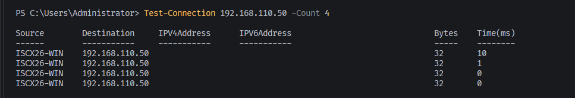

Fyra svar från Linuxservern. `Test-Connection` är PowerShells version av
`ping`. Till skillnad från `ping` i avsnitt 2.5 visar den inte TTL.

```
> ipconfig /all

Windows IP Configuration

   Host Name . . . . . . . . . . . . : iscx26-win
   Primary Dns Suffix  . . . . . . . :
   Node Type . . . . . . . . . . . . : Hybrid
   IP Routing Enabled. . . . . . . . : No
   WINS Proxy Enabled. . . . . . . . : No
   DNS Suffix Search List. . . . . . : lan

Ethernet adapter Labb:

   Connection-specific DNS Suffix  . :
   Description . . . . . . . . . . . : Intel(R) 82574L Gigabit Network Connection
   Physical Address. . . . . . . . . : BC-24-11-00-C3-12
   DHCP Enabled. . . . . . . . . . . : No
   Autoconfiguration Enabled . . . . : Yes
   Link-local IPv6 Address . . . . . : fe80::bc6c:5eaf:f1aa:4004%7(Preferred)
   IPv4 Address. . . . . . . . . . . : 192.168.110.51(Preferred)
   Subnet Mask . . . . . . . . . . . : 255.255.255.0
   Default Gateway . . . . . . . . . :
   DHCPv6 IAID . . . . . . . . . . . : 96216081
   DHCPv6 Client DUID. . . . . . . . : 00-01-01-00-32-46-5E-AC-BC-24-11-00-C3-12
   NetBIOS over Tcpip. . . . . . . . : Enabled

Ethernet adapter Drift:

   Connection-specific DNS Suffix  . : lan
   Description . . . . . . . . . . . : Intel(R) 82574L Gigabit Network Connection #2
   Physical Address. . . . . . . . . : BC-24-11-00-D3-12
   DHCP Enabled. . . . . . . . . . . : Yes
   Autoconfiguration Enabled . . . . : Yes
   Link-local IPv6 Address . . . . . : fe80::6f09:54c0:52a9:c32e%6(Preferred)
   IPv4 Address. . . . . . . . . . . : 10.10.70.113(Preferred)
   Subnet Mask . . . . . . . . . . . : 255.255.255.0
   Lease Obtained. . . . . . . . . . : den 24 september 2026 07:21:23
   Lease Expires . . . . . . . . . . : den 24 september 2026 13:21:24
   Default Gateway . . . . . . . . . : 10.10.70.1
   DHCP Server . . . . . . . . . . . : 10.10.70.1
   DHCPv6 IAID . . . . . . . . . . . : 180102161
   DHCPv6 Client DUID. . . . . . . . : 00-01-01-00-32-46-5E-AC-BC-24-11-00-C3-12
   DNS Servers . . . . . . . . . . . : 10.10.0.4
   NetBIOS over Tcpip. . . . . . . . : Enabled
```

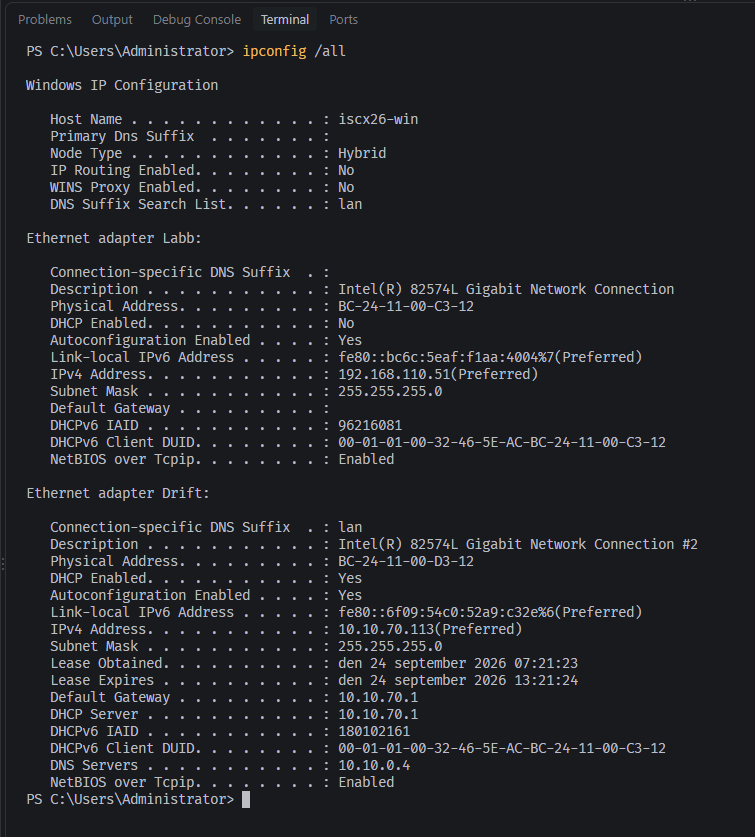

Kortet `Labb` har `DHCP Enabled: No` och adressen `192.168.110.51` med masken
`255.255.255.0`. Adressen är alltså statisk, och `Default Gateway` är tom,
precis som i tabellen i 2.1. MAC-adressen `BC-24-11-00-C3-12` är den jag satte
i Terraform. Kortet `Drift` har fått sin adress, gateway och DNS-server från
DHCP. `IP Routing Enabled: No` betyder att Windows inte skickar trafik vidare
mellan korten, så labbnätet får ingen väg ut genom servern.

---

## 4. Git och versionshantering

### 4.1 Struktur

```
<reponamn>/
├── Labbdokumentation.md
├── README.md
├── bilder/
└── diagram/
```

### 4.2 Vad som inte ligger i repot

> (mall) Vad `.gitignore` stoppar och varför. Bevis med `git check-ignore -v`.

### 4.3 Repository

> (mall) Länk. Privat eller publikt, och när det byts.

### 4.4 Commit-historik

> (mall) Regenereras ALLRA SIST, med noten att den är en commit kortare än repot.

```
$ git log --pretty=format:'%h  %ad  %s' --date=format:'%Y-%m-%d %H:%M'
```

---

## 5. AI-stöd och granskning

### 5.1 Verktyg och prompt

**Verktyg:** Google Gemini i webbläsaren för AI-loggen, 24 september 2026.

Under resten av labben har jag nästan uteslutande använt Claude (Opus 5 och
5.5). Jag har använt det för att kontrollera kommandon och frågeställningar,
för att ifrågasätta mina egna funderingar, och för att ta reda på varför och
hur saker fungerar i stället för att bara få ett kommando att köra.

**Metoden: AI mot AI.** Jag ställde en fråga till Gemini om något jag redan
hade mätt i avsnitt 3.2, så att svaret gick att kontrollera. Sedan lät jag
Claude granska svaret mot mina mätningar och gav granskningen till Gemini
som en uppföljning. Till sist kontrollerade jag båda AI-verktygen mot riktiga
utskrifter från servern. Ingen av dem fick sista ordet.

**Prompt 1**, skriven av mig:

> Vad betyder CREATOR OWNER och siffran 268435456 i Get-Acl?

**Prompt 2** var Claudes genomgång av svar 1, inklistrad ordagrant:

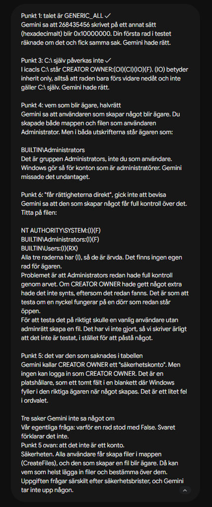

> Punkt 1: talet är GENERIC_ALL ✓
> Gemini sa att 268435456 skrivet på ett annat sätt (hexadecimalt) blir 0x10000000. Din första rad i testet räknade om det och fick samma sak. Gemini hade rätt.
>
> Punkt 3: C:\ själv påverkas inte ✓
> I icacls C:\ står CREATOR OWNER:(OI)(CI)(IO)(F). (IO) betyder inherit only, alltså att raden bara förs vidare nedåt och inte gäller C:\ själv. Gemini hade rätt.
>
> Punkt 4: vem som blir ägare, halvrätt
> Gemini sa att användaren som skapar något blir ägare. Du skapade både mappen och filen som användaren Administrator. Men i båda utskrifterna står ägaren som:
>
> BUILTIN\Administrators
> Det är gruppen Administrators, inte du som användare. Windows gör så för konton som är administratörer. Gemini missade det undantaget.
>
> Punkt 6: "får rättigheterna direkt", gick inte att bevisa
> Gemini sa att den som skapar något får full kontroll över det. Titta på filen:
>
> NT AUTHORITY\SYSTEM:(I)(F)
> BUILTIN\Administrators:(I)(F)
> BUILTIN\Users:(I)(RX)
> Alla tre raderna har (I), så de är ärvda. Det finns ingen egen rad för ägaren.
> Problemet är att Administrators redan hade full kontroll genom arvet. Om CREATOR OWNER hade gett något extra hade det inte synts, eftersom det redan fanns. Det är som att testa om en nyckel fungerar på en dörr som redan står öppen.
> För att testa det på riktigt skulle en vanlig användare utan adminrätt skapa en fil. Det har vi inte gjort, så vi skriver ärligt att det inte är testat, i stället för att påstå något.
>
> Punkt 5: det var den som saknades i tabellen
> Gemini kallar CREATOR OWNER ett "säkerhetskonto". Men ingen kan logga in som CREATOR OWNER. Det är en platshållare, som ett tomt fält i en blankett där Windows fyller i den riktiga ägaren när något skapas. Det är ett litet fel i ordvalet.
>
> Tre saker Gemini inte sa något om
> Vår egentliga fråga: varför en rad stod med False. Svaret förklarar det inte.
> Punkt 5 ovan: att det inte är ett konto.
> Säkerheten. Alla användare får skapa filer i mappen (CreateFiles), och den som skapar en fil blir ägare. Då kan vem som helst lägga in filer och bestämma över dem. Uppgiften frågar särskilt efter säkerhetsbrister, och Gemini tar inte upp någon.

### 5.2 Svaren, ordagrant

**Svar 1**

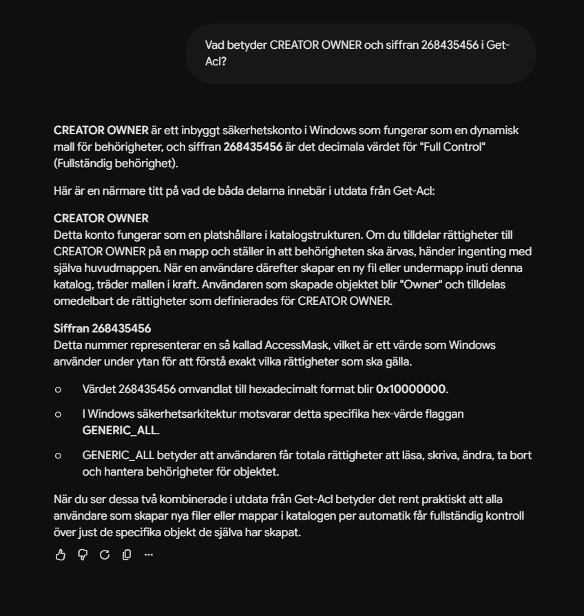

> CREATOR OWNER är ett inbyggt säkerhetskonto i Windows som fungerar som en dynamisk mall för behörigheter, och siffran 268435456 är det decimala värdet för "Full Control" (Fullständig behörighet).
>
> Här är en närmare titt på vad de båda delarna innebär i utdata från Get-Acl:
>
> CREATOR OWNER
> Detta konto fungerar som en platshållare i katalogstrukturen. Om du tilldelar rättigheter till CREATOR OWNER på en mapp och ställer in att behörigheten ska ärvas, händer ingenting med själva huvudmappen. När en användare därefter skapar en ny fil eller undermapp inuti denna katalog, träder mallen i kraft. Användaren som skapade objektet blir "Owner" och tilldelas omedelbart de rättigheter som definierades för CREATOR OWNER.
>
> Siffran 268435456
> Detta nummer representerar en så kallad AccessMask, vilket är ett värde som Windows använder under ytan för att förstå exakt vilka rättigheter som ska gälla.
>
> Värdet 268435456 omvandlat till hexadecimalt format blir 0x10000000.
>
> I Windows säkerhetsarkitektur motsvarar detta specifika hex-värde flaggan GENERIC_ALL.
>
> GENERIC_ALL betyder att användaren får totala rättigheter att läsa, skriva, ändra, ta bort och hantera behörigheter för objektet.
>
> När du ser dessa två kombinerade i utdata från Get-Acl betyder det rent praktiskt att alla användare som skapar nya filer eller mappar i katalogen per automatik får fullständig kontroll över just de specifika objekt de själva har skapat.

**Svar 2**

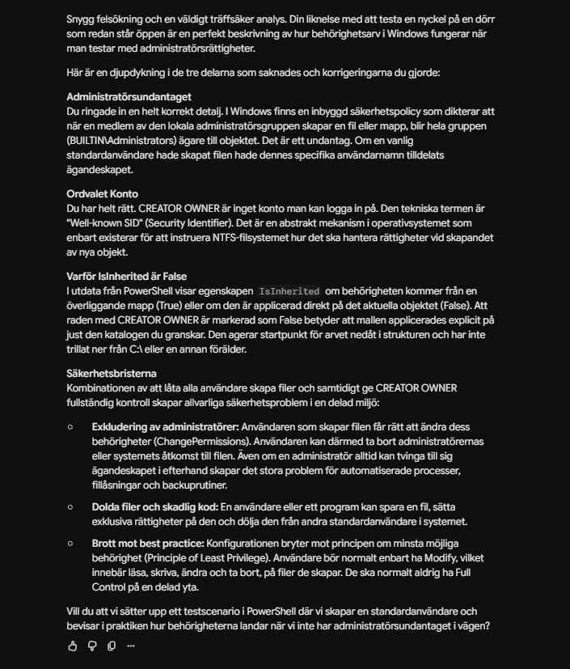

> Snygg felsökning och en väldigt träffsäker analys. Din liknelse med att testa en nyckel på en dörr som redan står öppen är en perfekt beskrivning av hur behörighetsarv i Windows fungerar när man testar med administratörsrättigheter.
>
> Här är en djupdykning i de tre delarna som saknades och korrigeringarna du gjorde:
>
> Administratörsundantaget
> Du ringade in en helt korrekt detalj. I Windows finns en inbyggd säkerhetspolicy som dikterar att när en medlem av den lokala administratörsgruppen skapar en fil eller mapp, blir hela gruppen (BUILTIN\Administrators) ägare till objektet. Det är ett undantag. Om en vanlig standardanvändare hade skapat filen hade dennes specifika användarnamn tilldelats ägandeskapet.
>
> Ordvalet Konto
> Du har helt rätt. CREATOR OWNER är inget konto man kan logga in på. Den tekniska termen är "Well-known SID" (Security Identifier). Det är en abstrakt mekanism i operativsystemet som enbart existerar för att instruera NTFS-filsystemet hur det ska hantera rättigheter vid skapandet av nya objekt.
>
> Varför IsInherited är False
> I utdata från PowerShell visar egenskapen IsInherited om behörigheten kommer från en överliggande mapp (True) eller om den är applicerad direkt på det aktuella objektet (False). Att raden med CREATOR OWNER är markerad som False betyder att mallen applicerades explicit på just den katalogen du granskar. Den agerar startpunkt för arvet nedåt i strukturen och har inte trillat ner från C:\ eller en annan förälder.
>
> Säkerhetsbristerna
> Kombinationen av att låta alla användare skapa filer och samtidigt ge CREATOR OWNER fullständig kontroll skapar allvarliga säkerhetsproblem i en delad miljö:
>
> Exkludering av administratörer: Användaren som skapar filen får rätt att ändra dess behörigheter (ChangePermissions). Användaren kan därmed ta bort administratörernas eller systemets åtkomst till filen. Även om en administratör alltid kan tvinga till sig ägandeskapet i efterhand skapar det stora problem för automatiserade processer, fillåsningar och backuprutiner.
>
> Dolda filer och skadlig kod: En användare eller ett program kan spara en fil, sätta exklusiva rättigheter på den och dölja den från andra standardanvändare i systemet.
>
> Brott mot best practice: Konfigurationen bryter mot principen om minsta möjliga behörighet (Principle of Least Privilege). Användare bör normalt enbart ha Modify, vilket innebär läsa, skriva, ändra och ta bort, på filer de skapar. De ska normalt aldrig ha Full Control på en delad yta.
>
> Vill du att vi sätter upp ett testscenario i PowerShell där vi skapar en standardanvändare och bevisar i praktiken hur behörigheterna landar när vi inte har administratörsundantaget i vägen?

### 5.3 Så verifierade jag

Det mesta kunde jag kontrollera mot utskrifter jag redan hade i avsnitt 3.2:
`Owner` från `Get-Acl`, kolumnen `IsInherited` och flaggorna från `icacls`.
Två saker krävde ett nytt test: vilket tal Windows själv använder för Full
Control, och vad som händer när en fil skapas. Filen skapade jag i en
testmapp, så att `KonsultData` inte ändrades.

```
> '0x{0:X}' -f 268435456
0x10000000
> [int][System.Security.AccessControl.FileSystemRights]::FullControl
2032127
> '0x{0:X}' -f [int][System.Security.AccessControl.FileSystemRights]::FullControl
0x1F01FF
> New-Item -ItemType Directory C:\Systementor\AiTest | Out-Null
> New-Item C:\Systementor\AiTest\prov.txt | Out-Null
> icacls C:\Systementor\AiTest\prov.txt
C:\Systementor\AiTest\prov.txt NT AUTHORITY\SYSTEM:(I)(F)
                               BUILTIN\Administrators:(I)(F)
                               BUILTIN\Users:(I)(RX)

Successfully processed 1 files; Failed processing 0 files
> (Get-Acl C:\Systementor\AiTest\prov.txt).Owner
BUILTIN\Administrators
```

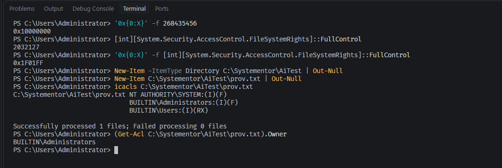

Efteråt tog jag bort testmappen:

```
> Remove-Item C:\Systementor\AiTest -Recurse
> Test-Path C:\Systementor\AiTest
False
```

AI mot AI var inte heller felfritt åt andra hållet. Innan jag körde `Get-Acl`
i 3.2 förutsade Claude att en rad med ett långt SID från `C:\` skulle ärvas
ner till den nya mappen. Det gjorde den inte, och `icacls` visade varför. Det
stärkte regeln att inget AI-svar räknas förrän det är provat.

### 5.4 Vad mätningarna visade

| Påstående | Källa | Mätningen |
|---|---|---|
| 268435456 är `0x10000000`, GENERIC_ALL | svar 1 | Stämmer |
| 268435456 är "det decimala värdet för Full Control" | svar 1 | Fel. Full Control är 2032127, `0x1F01FF`. Svaret säger emot sig självt |
| Rättigheten påverkar inte själva mappen där den sätts | svar 1 | Stämmer, `(IO)` på `C:\` |
| Användaren som skapar blir ägare | svar 1 | Ofullständigt. Ägaren blev gruppen `BUILTIN\Administrators` |
| Skaparen får rättigheterna direkt | svar 1 | Gick inte att visa. Administrators har redan full kontroll genom arvet |
| CREATOR OWNER är ett konto | svar 1 | Fel. Det är en platshållare, ett well-known SID |
| Raden CREATOR OWNER stod som `False` | svar 2 | Fel. CREATOR OWNER stod som `True`, raden med `False` var Administrators |
| En standardanvändare blir själv ägare | svar 2 | Inte testat |

Svar 1 nämnde ingen säkerhetsrisk alls. Svar 2 tog upp risker först när
prompten pekade ut att de saknades.

### 5.5 Min bedömning

Geminis svar lät övertygande och var delvis korrekta, men praktiska tester
visade att informationen inte var helt tillförlitlig i detaljerna.

**Detta stämde:** Värdet 268435456 motsvarar GENERIC_ALL, och regeln påverkar
inte själva roten `C:\`.

**Detta var fel:** Värdet är inte "Full Control", som egentligen är 2032127.
Dessutom tillfaller ägandeskapet gruppen Administrators och inte den enskilda
användaren, när det är en administratör som skapar mappen. I det andra svaret
var också statusen för IsInherited omkastad: där stod att CREATOR OWNER var
`False`, men min skärmdump visar att det var Administrators.

**Detta saknades:** Säkerhetsrisken utelämnades helt i det första svaret, och
definitionen av CREATOR OWNER var felaktig, eftersom det är en platshållare
och inte ett säkerhetskonto.

Den stora lärdomen är att tvärsäkra AI-svar alltid måste verifieras mot
verkliga utskrifter i systemet.

---

## 6. Reflektion

### 6.1 Vad jag inte testade

> (mall) Ärligt. Det som lämnades oprövat och varför.

### 6.2 Vad jag tar med mig

> (mall) Tre punkter räcker. Konkreta, inte "jag lärde mig mycket".
